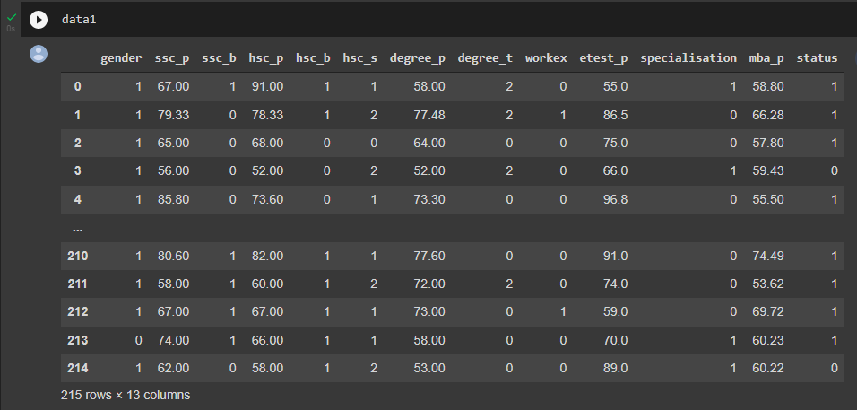

# Implementation-of-Logistic-Regression-Model-to-Predict-the-Placement-Status-of-Student

## AIM:
To write a program to implement the the Logistic Regression Model to Predict the Placement Status of Student.

## Equipments Required:
1. Hardware – PCs
2. Anaconda – Python 3.7 Installation / Moodle-Code Runner

## Algorithm
1. Import the standard library in python.
2. Use drop(),isnull()functions to check the empty set and remove the given data.
3. Import labelencoder form sklearn use the lr for given featuers.
4. Import train_test_split .
5. Use the metrices for accuracy value.
6. Import the classification report .
7. predict the value for unknown data.

## Program:
```
/*
Program to implement the the Logistic Regression Model to Predict the Placement Status of Student.
Developed by: B.Pavizhi
RegisterNumber: 212221230077

*/
```
```
import pandas as pd
data=pd.read_excel("/content/Placement_Data.csv")
data.head()
data1=data.copy()
data1=data1.drop(["s1_no","salary"],axis=1)
data1.head()
data1.isnull().sum()
data1.duplicated().sum()
from sklearn.preprocessing import LabelEncoder
le=LabelEncoder()
data1["gender"]=le.fit_transform(data1["gender"])
data1["ssc_b"]=le.fit_transform(data1["ssc_b"])
data1["hsc_b"]=le.fit_transform(data1["hsc_b"])
data1["hsc_s"]=le.fit_transform(data1["hsc_s"])
data1["degree_t"]=le.fit_transform(data1["degree_t"])
data1["workex"]=le.fit_transform(data1["workex"])
data1["specialisation"]=le.fit_transform(data1["specialisation"])
data1["status"]=le.fit_transform(data1["status"])
data1
x=data1.iloc[:,:-1]
x
y=data1["status"]
from sklearn.model_selection import train_test_split
x_train,x_test,y_train,y_test=train_test_split(x,y,test_size=0.2,random_state=0)
from sklearn.linear_model import LogisticRegression
lr=LogisticRegression(solver="liblinear")
lr.fit(x_train,y_train)
y_pred=lr.predict(x_test)
y_pred
from sklearn.metrics import accuracy_score
accuracy=accuracy_score(y_test,y_pred)
accuracy
from sklearn.metrics import confusion_matrix
confusion=confusion_matrix(y_test,y_pred)
confusion
from sklearn.metrics import classification_report
classification_report1=classification_report(y_test,y_pred)
classification_report1
lr.predict([[1,80,1,90,1,1,90,1,0,85,1,85]])
```

## Output:
### Head 1:

### Head 2:

### Encoder:

### Accuracy:

### Confusion:

### Classification:


### Prediction:
#### Y predict:

#### lr predict:


## Result:
Thus the program to implement the the Logistic Regression Model to Predict the Placement Status of Student is written and verified using python programming.
